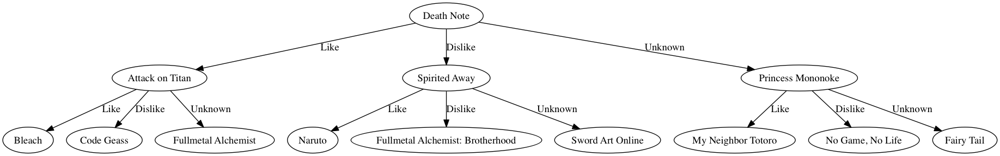

# Our Algorithms

First, we start with a brief description of the problems developed in a recommender system, and the existing algorithms to solve it. Then, we describe our innovative algorithm for preference elicitation.

## Recommender systems via collaborative filtering

Let us assume that we have $n$ users which have rated $m$ works in the database. Every user rates only a fraction of all items, and we would like to know which items to recommend to a certain user. This problem is called *collaborative filtering*.

Thus we have a matrix $R$ such that $r_{ui}$ denotes the rating of user $u$ over work $i$, if specified. As a lot of entries are missing, this matrix is *sparse*.

For example, on Mangaki, $n = 1,800$ users, $m = 14,000$ works and the number of specified entries in the matrix is $270,000$. So we only have access to $1\%$ of all entries and we would like to guess the remaining ones. This problem is called *matrix completion*.

### KNN: $k$-nearest neighbors

We implemented this algorithm for our recommendations.

1. Compute a **similarity score** between users
1. Determine $k$ nearest neighbors of a certain user $u$
1. Recommend to user $u$ what his nearest neighbors liked and that he did not watch yet.

The *similarity score* is the dot product of the ratings, where $1$ stands for like and $-1$ stands for dislike. Thus, any agreement over a work (like/like or dislike/dislike) increases the score, while a disagreement (like/dislike) decreases it.

All our algorithms are compared using cross-validation.

### SVD: singular value decomposition

This is another algorithm for matrix completion. We used the implementation provided in the open source Python library *scikit-learn* for machine learning.

## Adaptive testing for preference elicitation

For which works should we ask a newcomer “*Did you like this movie?*” in order to build his profile efficiently?

- Items should be **popular**, in order to be known by the user, so he can provide a rating.
- Items should be **controversial**, because for example, the fact that you liked *Star Wars* does not provide a lot of information about your tastes.

Our idea is to find items that bisect the best the userbase into three sets of roughly the same probability mass, see \ref{test}.

{width=100%}

# The Web Application

## Python

Python is a solid and well-known language in the landscape, used successfully by a huge number of companies and organizations.
This choice was also the most relevant for us as it is our favorite language, for its readability and simplicity.

## JavaScript

Most actions (rating, loading of works metadata such as title and poster) are made using AJAX calls. We plan to move to React.js.

## Django

Django is described as a "framework for perfectionists with deadlines", it revealed to be an empowering tool which gets rid of all the boilerplate that we could encounter while developing Mangaki.

Django powers Pinterest or Instagram, and also Facebook for various behind-the-scenes utilities. As a natural consequence for this success, we have [a bunch of Django packages available](http://awesome-django.com/) to speed up the development. Also, a really good point of Django is its crystal-clear documentation.

### Applications

Mangaki project currently uses two big Django applications:

* [Mangaki](https://github.com/mangaki/mangaki/tree/master/mangaki/mangaki), which is the core of the web application.
* [IRL](https://github.com/mangaki/mangaki/tree/master/mangaki/irl), which manages real-life matter that happens around the Mangaki community (partners and events).

Django enables us to:

* use its own ORM (*object-relational mapping*) which makes our life easier to model our data
* use PostgreSQL databases
* create our own admin commands to analyze user data and apply our algorithms on it  
([`findneighbors.py`](https://github.com/mangaki/mangaki/blob/master/mangaki/mangaki/management/commands/findneighbors.py) for example)
* easily version control our database [with migrations](https://github.com/mangaki/mangaki/tree/master/mangaki/mangaki/migrations)

### Configuration

Every Mangaki instance is easily configured with a `settings.py` file, together with a [`secret.py`](https://github.com/mangaki/mangaki/blob/master/mangaki/secret_template.py) file that contains all sensible data.

### Initial data feeding

We provide [initial, anonymous seed data](https://github.com/mangaki/mangaki/tree/master/fixtures) (called *fixtures*, in JSON format), which are loaded when a new Mangaki instance is provisioned.

### Notebooks

Thank to the `django-extensions` package, it is possible to use IPython notebooks to [keep tracking of ideas](https://github.com/mangaki/mangaki/tree/master/notebooks) and make reproducible demos and visualizations.

### Deployment of development environment

A Vagrantfile allows anyone to create Mangaki instances easily with [Vagrant](https://www.vagrantup.com/) and [a provisioning folder](https://github.com/mangaki/mangaki/tree/master/provisioning) which contains a Ansible playbook.

# Deployment using Azure

Azure enables a system to easily create virtual machines, which is an interesting point for us because we can spawn virtual machines on the fly or act on the infrastructure (advanced security policies with JSON Web Token) through a RESTful API, which is quite handy.

## Limiting human failures with Nginx

We can do anything we want while letting our production website alive.

Azure is the key to enable this feature: when we spawn virtual machines, we have a front Nginx web server which will serve our requests:

* api.mangaki.fr to the API server
* mangaki.fr to the production server
* dev.mangaki.fr to the development server
* research.mangaki.fr to the research server

The idea is to isolate our platform in different chunks of services. By doing this, we can enable Nginx to use the failover feature in the following way:

```
upstream mangaki_production {
        server {{ main_mangaki_production_server_ip }};
        server {{ fallback_mangaki_production_server_ip }} backup;
}
```

Thanks to this, we can connect a [confd-like](https://github.com/kelseyhightower/confd) to provision our Nginx config in real-time with the Azure API.

### Making contributors' life easier

As open source service contributors, we want to test and peer review our new features before putting them into production. It is difficult to coordinate all the changes though, we want a pipeline where we can aggregate a set of features, check their impact and push them to production.

Basically, we would like to have different environments of Mangaki, linked to a copy or a subset of the production database.

This is possible with Azure, we can dynamically spawn new routes in Nginx router or just aggregate them in a dev / staging environment, check the changes, talk with contributors, push them to production.

Thus, Azure is really a powerful infrastructure which enables our organization to gain more agility by writing smart integrations, scripts and triggers in order to make our life easier and let us focus on the code.

{width=95%}\